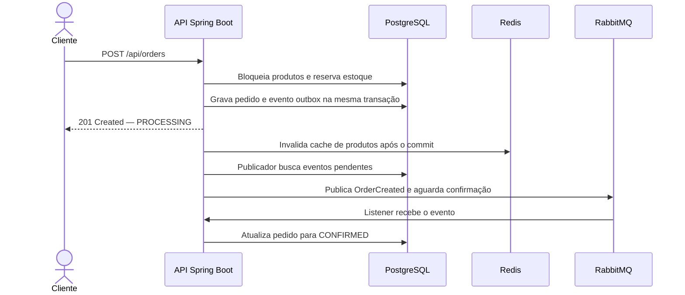

# Projeto de pedido em Java, SpringBoot, Postgres, Redis e RabbitMQ


> É uma API REST de pedidos feita em Java com Spring Boot. O projeto demonstra persistência relacional, cache, concorrência no estoque e processamento assíncrono de eventos.

## Objetivos de estudo

- Construir uma API REST em camadas com Java 21 e Spring Boot.
- Persistir produtos, pedidos e itens no PostgreSQL usando Spring Data JPA e Flyway.
- Reservar estoque com transações e bloqueio pessimista para proteger operações concorrentes.
- Usar Redis para cachear a consulta de produto e invalidar o cache após alterações no estoque.
- Processar a confirmação de pedidos com RabbitMQ, publisher confirms, retentativas e dead-letter queue.
- Aplicar o padrão Transactional Outbox para gravar o pedido e o evento na mesma transação.

## Tecnologias

| Tecnologia | Uso no projeto |
| --- | --- |
| Java 21 | Linguagem e versão alvo de compilação |
| Spring Boot 4.1.1 | API REST, injeção de dependência e configuração |
| Spring Data JPA / Hibernate | Mapeamento e persistência relacional |
| PostgreSQL 17 | Banco principal para catálogo, estoque e pedidos |
| Flyway | Versionamento do schema do banco |
| Redis 7.4 | Cache da consulta individual de produto, com TTL de 10 minutos |
| RabbitMQ 4.1 | Mensageria assíncrona, tentativas e dead-letter queue |
| Docker Compose | Ambiente local de infraestrutura |
| Maven | Dependências e build |

## Arquitetura e fluxo



O status inicial do pedido é `PROCESSING`. O listener do RabbitMQ muda o pedido para `CONFIRMED`. Se uma mensagem for entregue novamente, a confirmação é idempotente. Mensagens que falham após três tentativas são encaminhadas para a fila `order.created.dlq`.

O outbox pode republicar um evento se a aplicação cair depois da confirmação do RabbitMQ e antes de gravar `published_at`. Por isso, o consumidor precisa continuar idempotente.

## Executar localmente

### Pré-requisitos

- JDK 21 ou superior
- Maven 3.6.3 ou superior
- Docker com Docker Compose

### Subir os serviços e a aplicação

```bash
docker compose up -d
mvn spring-boot:run
```

A API estará em `http://localhost:8080`. O console de administração do RabbitMQ estará em `http://localhost:15672`, com usuário e senha locais `orderflow`.

Para parar os serviços:

```bash
docker compose down
```

Para apagar também os dados locais persistidos do PostgreSQL:

```bash
docker compose down -v
```

### Configuração

Os valores abaixo são padrões somente para desenvolvimento local. A aplicação aceita as variáveis de ambiente correspondentes:

| Variável | Padrão local | Serviço |
| --- | --- | --- |
| `DB_URL` | `jdbc:postgresql://localhost:5432/orderflow` | PostgreSQL |
| `DB_USER` | `orderflow` | PostgreSQL |
| `DB_PASSWORD` | `orderflow` | PostgreSQL |
| `REDIS_HOST` | `localhost` | Redis |
| `REDIS_PORT` | `6379` | Redis |
| `RABBITMQ_HOST` | `localhost` | RabbitMQ |
| `RABBITMQ_PORT` | `5672` | RabbitMQ |
| `RABBITMQ_USER` | `orderflow` | RabbitMQ |
| `RABBITMQ_PASSWORD` | `orderflow` | RabbitMQ |

## API REST

| Método | Endpoint | Descrição |
| --- | --- | --- |
| `POST` | `/api/products` | Cadastra produto e estoque inicial |
| `GET` | `/api/products` | Lista produtos |
| `GET` | `/api/products/{id}` | Consulta produto; usa cache Redis |
| `POST` | `/api/orders` | Cria pedido e reserva estoque |
| `GET` | `/api/orders/{id}` | Consulta pedido, itens, total e status |
| `GET` | `/actuator/health` | Verifica a saúde da aplicação |

### Cadastrar um produto

```bash
curl -i -X POST http://localhost:8080/api/products \
  -H 'Content-Type: application/json' \
  -d '{"name":"Teclado mecânico","price":349.90,"availableQuantity":12}'
```

Guarde o `id` retornado e use-o para criar o pedido:

```bash
curl -i -X POST http://localhost:8080/api/orders \
  -H 'Content-Type: application/json' \
  -d '{"items":[{"productId":"<ID_DO_PRODUTO>","quantity":2}]}'
```

A resposta do pedido inclui `id`, `total`, itens e status `PROCESSING`. Consulte o pedido para observar a transição para `CONFIRMED`:

```bash
curl -i http://localhost:8080/api/orders/<ID_DO_PEDIDO>
```

## Estrutura do projeto

```text
src/main/java/com/portfolio/orderflow/
├── messaging/   # Topologia RabbitMQ, publicação outbox e listener
├── order/       # Pedidos, itens, status e outbox
└── product/     # Produtos, estoque e cache
src/main/resources/
├── application.yaml
└── db/migration/ # Migrações SQL do Flyway
compose.yaml
pom.xml
```

## Próximas evoluções

- Adicionar chave de idempotência para requisições de criação de pedido.
- Criar testes unitários e testes de integração com Testcontainers.
- Expor métricas para eventos pendentes, falhas de publicação e mensagens na DLQ.
- Documentar os contratos da API com OpenAPI/Swagger.
- Adicionar autenticação e autorização para os endpoints administrativos.

## Observação

As credenciais do Compose são fixas e destinadas somente ao ambiente local de estudo. Não as reutilize em ambientes compartilhados ou de produção.
